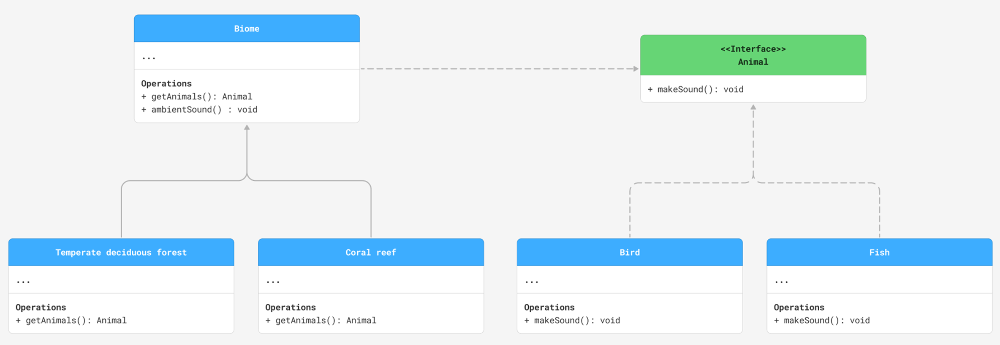

# Code to an interface, not an implementation
A01637124 Ana Karen Zetter Márquez

## Description
Instead of creating a class with separate methods for each type of animal and directly linking them to the Biome class, 
we use an interface called Animal, which all animal types inherit. 
This allows the Biome class to interact with different animals through a common interface:
It does not need to know which animals are in the Biome, it can simply instruct all animals to make a sound.
Each animal class implements its own behavior, such as making different sounds, without modifying the Biome class. 
This approach uses abstraction and polymorphism, making the code more maintainable and easier to extend.

